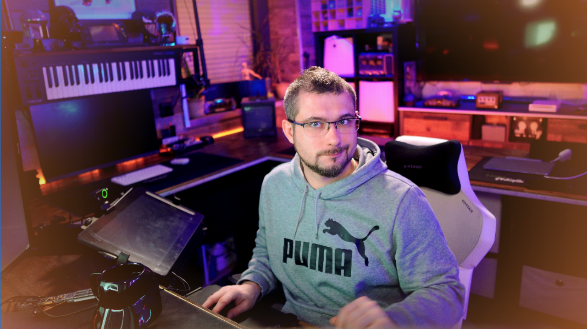
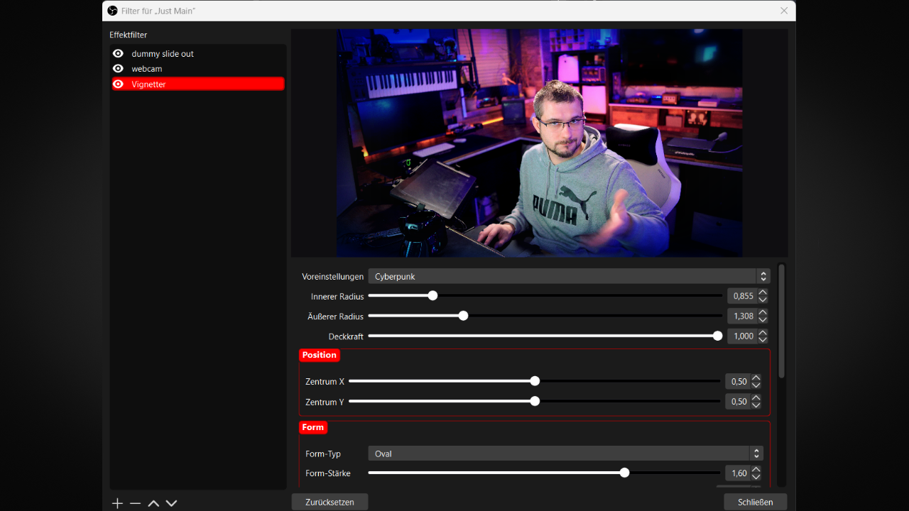
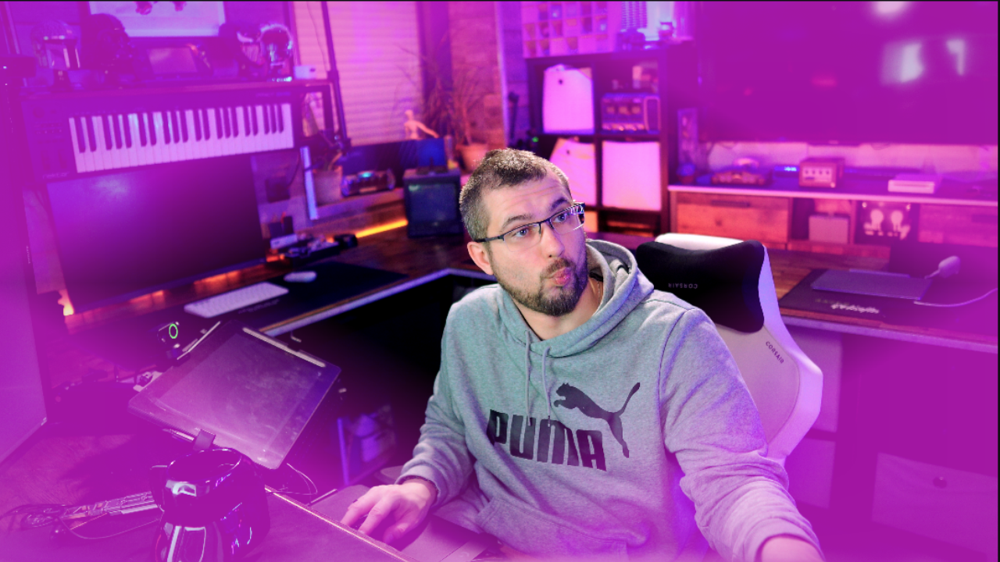
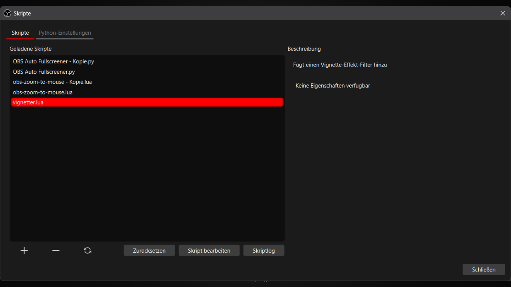
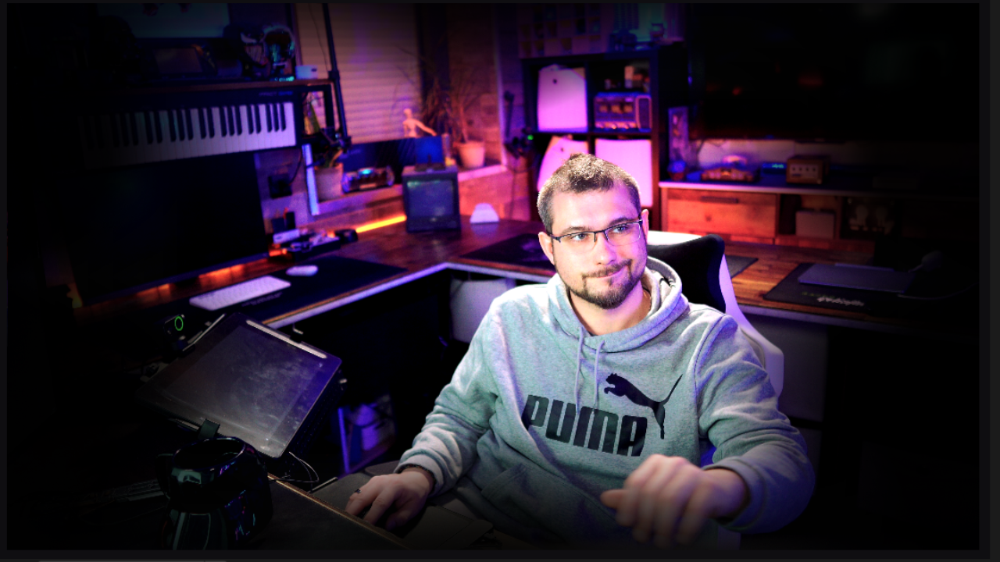
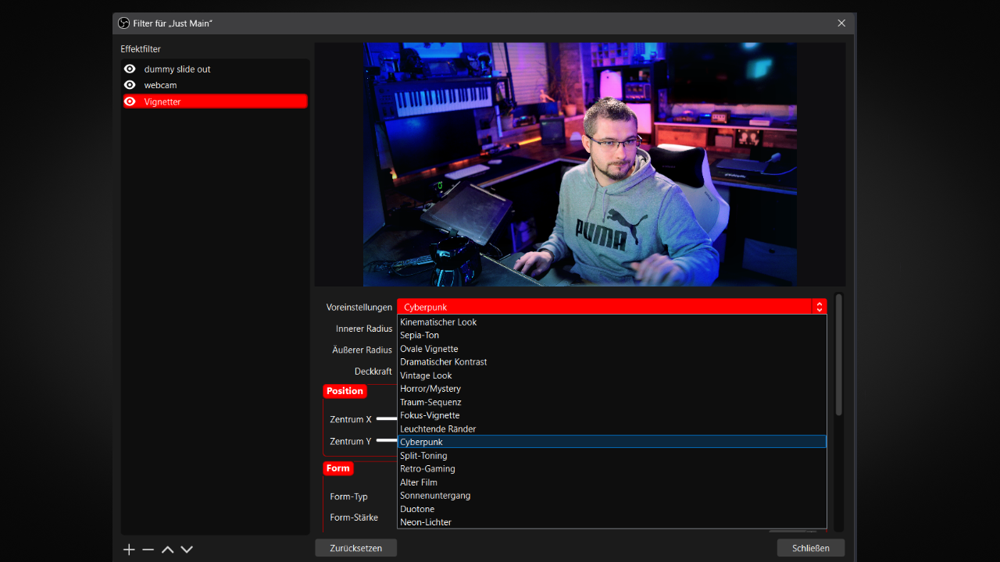
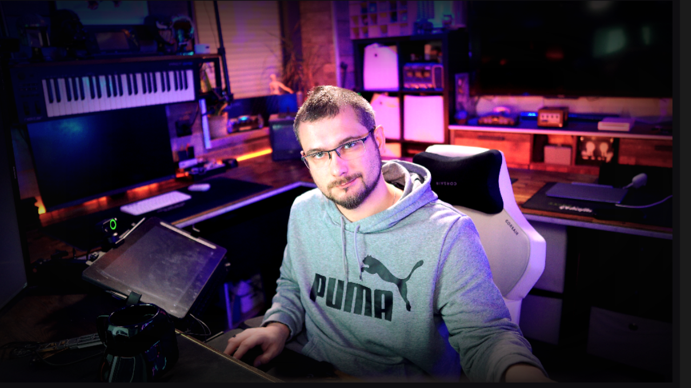
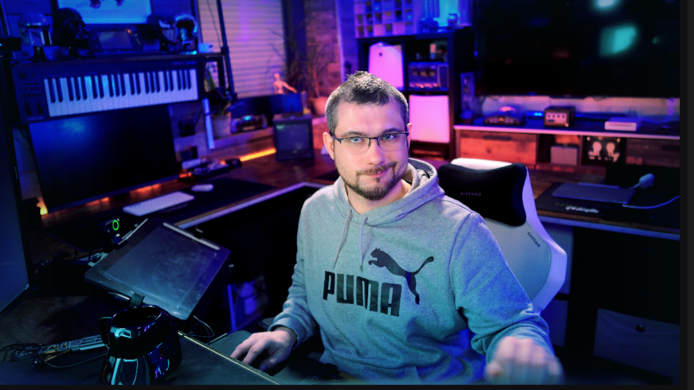

  <h1>🎨 Vignetter for OBS Studio</h1>
  
A comprehensive vignette effect filter plugin for OBS Studio with advanced customization options.

  
Perfect for streamers, content creators, and professional broadcasters.

  
  
  
  
  
  
  
  
  

  

## 📑 Table of Contents
- [✨ Key Features](#-key-features)
- [🎯 Use Cases](#-use-cases)
- [💻 Installation](#-installation)
- [🎨 Presets & Shapes](#-presets--shapes)
- [🛠️ Configuration](#️-configuration)
- [🎮 Usage](#-usage)
- [📸 Examples](#-examples)
- [🔧 Troubleshooting](#-troubleshooting)
- [📄 License](#-license)

## ✨ Key Features

### 🖌️ Advanced Vignette Customization
- **Highly Configurable Effects**: 
  - Adjust intensity, roundness, feathering, and opacity
  - Precise positioning with center X/Y controls
  - Real-time preview for immediate visual feedback
- **Multiple Vignette Shapes**:
  - Classic oval vignette
  - Rectangular with adjustable corner radius
  - Diamond shape for creative effects
  - Star shape for decorative purposes

  
  
<i>Different shape options available in Vignetter</i>

### 🎨 Creative Color Control
- **Custom Color Options**:
  - Use default darkening effect or choose custom colors
  - RGB color control for precise tint selection
  - Multiple blend modes (Normal, Multiply, Screen, Overlay)
- **Professional Presets**:
  - 16+ built-in presets including Cinematic, Vintage, Horror, and more
  - Creative options like Cyberpunk, Neon Lights, and Retro Gaming
  - Easy switching between different looks

  
  
<i>Color customization interface</i>

### ⚙️ Professional Features
- **Advanced Shape Control**:
  - Rotation for dynamic angle adjustment
  - Shape strength for intensity control
  - Aspect ratio adjustment for stretching effects
- **Localization**:
  - Built-in support for English and German
  - Easily expandable to other languages
  - Automatic language detection

## 🎯 Use Cases

### Streaming Setup
- Create professional-looking stream borders
- Add mood and atmosphere to gaming content
- Highlight specific areas of your broadcast
- Create distinct visual styles for different stream segments

  
  
<i>Example of Vignetter enhancing a gaming stream</i>

### Content Creation
- Add cinematic quality to video productions
- Create nostalgic vintage looks for themed content
- Enhance focus on subjects with targeted vignetting
- Match visual style to branding with custom colors

### Creative Effects
- Design unique overlays with star and diamond shapes
- Create cyberpunk or futuristic aesthetics
- Develop signature looks with custom presets
- Enhance mood with color-tinted vignettes

  
  
<i>Creative vignette effects using different shapes and colors</i>

## 💻 Installation

1. Download the latest release from the [Releases](https://github.com/TheGeekFreaks/Vignetter/releases) page
2. Place the script in your OBS scripts folder:
   - Windows: `%APPDATA%\obs-studio\scripts`
   - macOS: `~/Library/Application Support/obs-studio/scripts`
   - Linux: `~/.config/obs-studio/scripts`
3. In OBS Studio:
   - Go to Tools → Scripts
   - Click the + button
   - Select the downloaded `vignetter.lua` file
   - Add as a filter to any source or scene

  
  
<i>Installing Vignetter in OBS Studio</i>

### Platform-Specific Notes

#### Windows
- Compatible with Windows 10/11
- OBS Studio 30.0+ recommended
- No additional dependencies required

#### macOS
- Compatible with macOS 11.0 (Big Sur) or higher
- OBS Studio 30.0+ recommended
- No additional dependencies required

#### Linux
- Compatible with most modern distributions
- OBS Studio 30.0+ recommended
- No additional dependencies required

## 🎨 Presets & Shapes

### Built-in Presets
Vignetter includes 16+ professionally designed presets for instant looks:

1. **Cinematic Look**: Film-like widescreen appearance
2. **Sepia Tone**: Warm vintage effect
3. **Oval Vignette**: Traditional photography style
4. **Dramatic Contrast**: Strong vignette with high contrast
5. **Vintage Look**: Faded colors with subtle sepia
6. **Horror/Mystery**: Dark with slight blue tint
7. **Dream Sequence**: Soft with white glow
8. **Focus Vignette**: Highlights specific areas

  
  
<i>Standard vignette presets in action</i>

**Creative Presets**:
- **Glowing Borders**: Inverted with golden edges
- **Cyberpunk**: Futuristic with blue tones
- **Split-Toning**: Diamond shape with warm orange
- **Retro Gaming**: Star-shaped purple vignette
- **Old Film**: Strong edge darkening
- **Sunset**: Warm orange tones
- **Duotone**: Blue-green contrast
- **Neon Lights**: Vibrant pink club-like effect

  
  
<i>Creative presets for unique visual styles</i>

### Available Shapes
- **Oval**: Traditional rounded vignette
- **Rectangle**: Squared edges with adjustable corners
- **Diamond**: Angular creative effect
- **Star**: Decorative star-shaped pattern

## 🛠️ Configuration

### Basic Settings
1. **Radius Controls**:
   - Inner Radius: Size of visible area (0.0-5.0)
   - Outer Radius: Extension of vignette (0.0-5.0)
   - Opacity: Effect transparency (0.0-1.0)

2. **Position Controls**:
   - Center X/Y: Position of vignette (0.0-1.0)
   - Aspect Ratio: Width/height shape ratio (0.5-2.0)

3. **Shape Options**:
   - Shape Type: Select between oval, rectangle, diamond, or star
   - Shape Strength: Intensity of shape effect (0.5-2.0)
   - Rotation: Angle of the vignette shape (0.0-360.0)

  
  
<i>Vignetter's comprehensive configuration interface</i>

### Color Settings
- **Custom Color Toggle**: Enable/disable custom vignette color
- **RGB Controls**: Adjust red, green, and blue components (0.0-1.0)
- **Blend Mode**: Choose between Normal, Multiply, Screen, and Overlay

## 🎮 Usage

1. **Adding the Filter**:
   - In OBS, right-click any source → Filters
   - Click "+" under Effect Filters
   - Select "Vignetter"

  
  
<i>Adding Vignetter as a filter in OBS Studio</i>

2. **Quick Setup**:
   - Choose a preset from the dropdown menu
   - Adjust basic parameters as needed
   - Fine-tune color and shape settings

3. **Advanced Customization**:
   - Select vignette shape
   - Adjust position and rotation
   - Set custom color and blend mode
   - Fine-tune radius and opacity

  
  
<i>Advanced customization options in action</i>

## 📸 Examples

Here are some examples of different vignette effects created with the plugin:

  
  
<i>Cinematic vignette preset</i>

  
  
<i>Horror/Mystery vignette preset</i>

  
  
<i>Cyberpunk vignette preset</i>

  
  
<i>Retro Gaming vignette preset with star shape</i>

## 🔧 Troubleshooting

### Common Issues
1. **Filter Not Appearing**:
   - Ensure script is properly installed
   - Check OBS Studio version (30.0+ recommended)
   - Try restarting OBS

2. **Visual Glitches**:
   - Reset parameters to defaults
   - Try a different preset
   - Check for graphics driver updates

3. **Performance Issues**:
   - Reduce complexity of other effects
   - Consider hardware requirements
   - Update to latest OBS version

### Support
- Check the [GitHub Issues](https://github.com/TheGeekFreaks/Vignetter/issues) page
- Join our [Discord](https://tgf.click/discord) for help
- Submit detailed bug reports with OBS logs

## 📄 License

This project is licensed under the GNU General Public License v3.0 - see the [LICENSE](LICENSE) file for details.

---

  
 TheGeekFreaks &copy; 2025

  

    <a href="https://tgf.click/discord">Discord</a> &bull;
    <a href="https://github.com/TheGeekFreaks">GitHub</a> &bull;
    <a href="https://www.youtube.com/TheGeekFreaks">YouTube</a>
  

